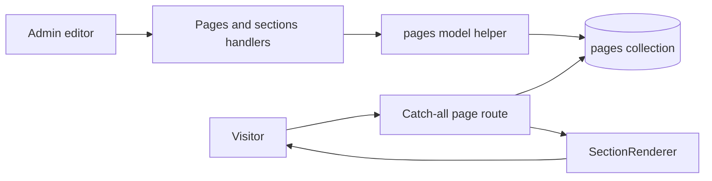
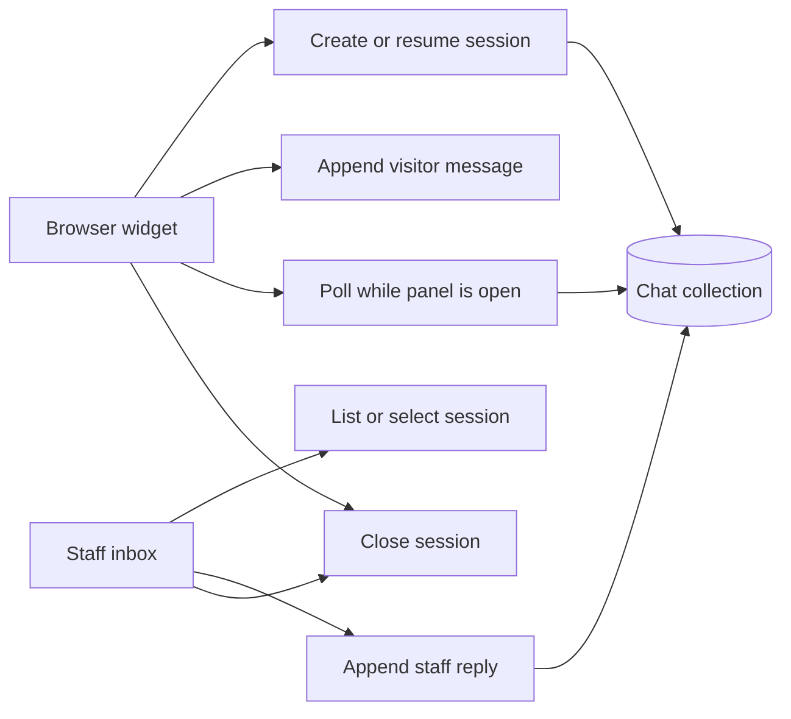

# Betopia PulseGrid - API, Data, and Integration Reference

> Public engineering reference for the reviewed private API surface. [Return to the overview](README.md).

## API design

The current application uses 23 Next.js route handlers under `src/app/api`. They act as a compact internal REST layer for the public frontend and staff CMS. The surface is organized by domain rather than a versioned external developer API, so it should not be treated as a supported public integration contract.

## Route handler inventory

| Domain | Current route family | Methods | Responsibility |
|---|---|---|---|
| Authentication | `/api/auth/login`, `/logout`, `/seed` | `POST` | Credential session, logout, development bootstrap. |
| CMS pages | `/api/pages`, `/api/pages/:slug`, `/api/pages/:slug/sections` | `GET`, `POST`, `PUT`, `DELETE` | Page metadata, publishing state, and embedded section operations. |
| Services | `/api/services`, `/api/services/:id` | `GET`, `POST`, `PUT`, `DELETE` | Active/public listing plus staff create/update/delete and route revalidation. |
| Leadership | `/api/leaders`, `/api/leaders/:id` | `GET`, `POST`, `PUT`, `DELETE` | Public listing plus staff CRUD and route revalidation. |
| Settings | `/api/settings` | `GET`, `PUT` | Singleton company/contact/social configuration. |
| Contact | `/api/contact/submit`, `/api/contact/submissions` | `POST`; `GET`, `PATCH`, `DELETE` | Public contact submission and staff inbox lifecycle. |
| Media | `/api/upload`, `/api/images/:id` | `POST`, `GET` | Validated GridFS upload and streaming delivery. |
| Visitor chat | `/api/chat/session`, `/message`, `/terminate` | `GET`, `POST` | Create/resume session, append message, close session. |
| Staff chat | `/api/chat/admin/sessions`, `/session`, `/reply`, `/read`, `/terminate` | `GET`, `POST`, `PATCH`, `DELETE` | Inbox, thread detail, reply, read tracking, and closure. |

## Data stores and model operations

| Store | Representative model operations |
|---|---|
| `pages` | List lightweight page metadata, find by slug, create/update/delete page, add/update/delete/reorder embedded sections. |
| `services` | Controlled first-time preload, active/all list, record CRUD, display ordering, response serialization. |
| `leaders` | Controlled first-time preload, active/all list, record CRUD, display ordering, response serialization. |
| `site_settings` | Read and update singleton settings document, used by root site layout. |
| `contact_submissions` | Create inquiry, paginate/list inbox, read-state changes, controlled deletion. |
| chat collection | Session creation/resume, message append, staff/visitor read marking, filtering, termination. |
| GridFS `images` | Upload stream, file metadata lookup, download stream, safe bucket deletion. |

The model helpers serialize MongoDB `ObjectId` fields to strings before returning records to React/JSON boundaries. This is a necessary server-component and route-handler interoperability detail: BSON identifiers cannot be passed safely into browser JSON unchanged.

## CMS page request flow

The catch-all route queries the published page and its related active service/leader collections in parallel. It returns `notFound()` when the page cannot be resolved, keeping draft/unavailable content off the public route.

## Contact and chat persistence

### Contact

The public contact endpoint requires at least a first name and email, persists the result as unread, and returns a created response. The staff contact handler supports paginated reads, read-state updates, and deletion only after a submission has been viewed. This prevents accidental deletion of unreviewed inbox items.

### Chat

The system maintains browser session continuity through a locally stored session key. Neither side can continue sending after a session is closed; the visitor can start a fresh conversation. The current polling design avoids a WebSocket dependency but should be measured as chat volume grows.

## Integration boundaries

| Concern | Current approach | Future-safe direction |
|---|---|---|
| Media | GridFS controlled by application helpers | Reference tracking, image transforms, orphan cleanup, CDN strategy. |
| Authentication | JWT cookie for staff login | Central `requireAdmin` helper, RBAC claims, rotation/revocation, audit events. |
| Public freshness | `revalidatePath` plus polling | Cache policy by route, event-driven update channel where justified. |
| Validation | Required-field and MIME/size checks in selected handlers; validation libraries are installed | Shared Zod schemas at every request boundary. |
| Email/CRM | Contact record/inbox only | Adapter boundary for CRM, notifications, assignments, and deliverability logic. |
| Analytics | SRS direction only | Consent-aware provider integration, event schema, and protected reporting. |

## API invariants for future development

1. Keep public reads, user-owned data, and staff mutations in distinct authorization categories.
2. Validate and normalize every mutation on the server; never treat browser values as trusted persistence input.
3. Serialize MongoDB-specific values at the model/API boundary.
4. Revalidate or invalidate every public surface affected by an administrative change.
5. Define record/media lifecycle together; deletion should not leave untracked GridFS files.
6. Document stable external APIs separately from internal frontend handlers before third-party consumption is allowed.

## Public boundary

The private response shapes, database values, configuration, credentials, and exact operational queries are intentionally excluded. Endpoint names are shown only to demonstrate the present architecture and boundaries.
