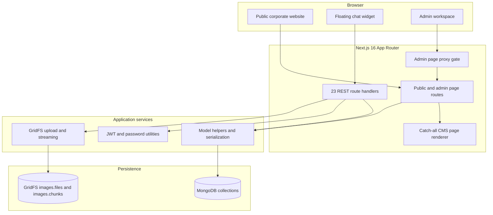
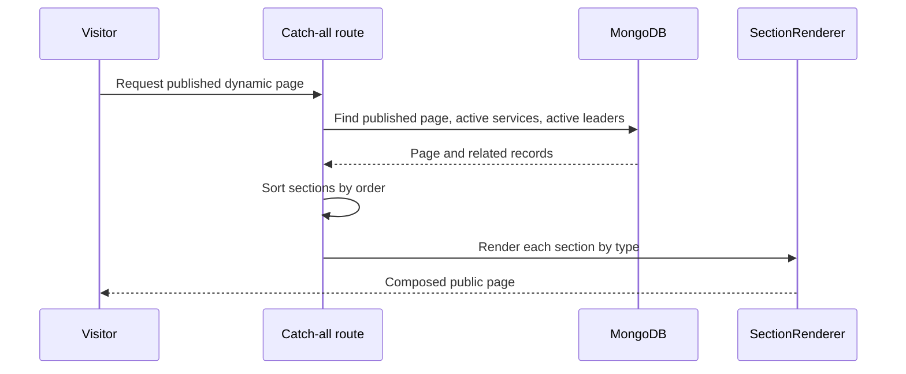

<div align="center">

# Betopia PulseGrid

### Full-stack corporate CMS, public website, and live customer-conversation platform

## Live application

[https://betopia-pulse-grid-fullstack.vercel.app/](https://betopia-pulse-grid-fullstack.vercel.app/)

[](#implementation-status)
[](https://nextjs.org/)
[](https://react.dev/)
[](https://www.mongodb.com/)
[](#public-review-boundary)

**A public technical review of a private implementation.** It explains the product, architecture, engineering decisions, current capabilities, and upgrade opportunities without publishing source, configuration, or data.

</div>

---

## Product overview

Betopia PulseGrid is a corporate digital platform for an energy, infrastructure, and supply-chain business. It combines a responsive public marketing site with a MongoDB-backed CMS, protected staff workspace, contact-inquiry inbox, managed media, and a persistent two-way live-chat channel.

It is implemented as one **Next.js 16 App Router** application rather than a disconnected brochure site and external CMS. Public pages, staff operations, and browser support chat share the same application, data store, and operational model.

| Experience | Audience | Delivered capability |
|---|---|---|
| Public website | Prospects, clients, and visitors | Corporate pages, services, leadership, contact, dynamic published pages, smooth navigation, and support chat |
| Dynamic page system | Content editors | Page creation, draft/published state, ordered sections, reusable visual blocks, and GridFS images |
| Operations CMS | Authorized staff | Dashboard, page/section editor, services, leadership, settings, contact inbox, media upload, and chat inbox |
| Contact workflow | Visitors and staff | Public submission, unread/read tracking, protected staff review, and controlled deletion of viewed messages |
| Live chat | Visitors and staff | Persistent visitor session, two-way replies, unread markers, open/closed states, and termination by either side |

### Implementation size

| Measure | Private application |
|---|---:|
| JavaScript / JSX application files | 120 |
| Application lines | ~8,047 |
| Reusable components | 49 |
| MongoDB model modules | 6 |
| Next.js API route handlers | 23 |
| App Router page entries | 21 |

## User-facing capabilities

### Public experience

- Responsive home, about, services, leadership, contact, career, blog, and catch-all CMS-page routes.
- Live service and leadership content, including active/inactive visibility controls maintained in the CMS.
- Page-specific metadata for published catch-all CMS pages.
- Global header/footer, smooth scrolling that respects reduced-motion preference, animated content, and a persistent floating chat widget.
- Contact form that persists inquiries for staff review.

### Staff experience

- Admin login and protected page routes.
- Dashboard plus management workspaces for services, leadership, pages, settings, contact submissions, and chat.
- Section-based page editor with ordered blocks, reusable field forms, image uploads, publishing state, and section reordering.
- Service/leadership content changes trigger route revalidation; already-open public sections poll for updates approximately every five seconds.
- Live support inbox with open/closed filters, unread state, message read marking, replies, and conversation termination.

## Technical stack

| Layer | Current technologies | Engineering role |
|---|---|---|
| Application | Next.js `16.1.6`, React `19.2.3` | App Router, server components, dynamic pages, route handlers, metadata |
| Styling | Tailwind CSS `4`, PostCSS, global CSS | Responsive layout, design consistency, utilities, animation integration |
| Data | MongoDB Node driver `7.1.0`, GridFS | Content documents, settings, contacts, chat sessions/messages, binary media |
| Authentication | `jose` `6.1.3`, `bcryptjs` `3.0.3` | HMAC JWT sessions, httpOnly cookie, password verification |
| Forms | React Hook Form, Formik, Yup, Zod | Current form implementation plus validation/tooling capacity for further hardening |
| Interaction | Framer Motion, Lenis, Swiper, Embla, Lucide, React Hot Toast | Motion, smooth scrolling, carousels, icons, and feedback states |
| Operations tooling | Axios, date-fns, nanoid, Sharp | Client HTTP, date formatting, section IDs, and image pipeline support |
| Quality tooling | ESLint 9, `eslint-config-next/core-web-vitals`, Prettier, bundle analyzer | Static quality checks and future performance analysis |

## System architecture



### Rendering and content flow



The public catch-all route resolves a published page plus active services and leaders in parallel, serializes MongoDB identifiers for React, sorts the embedded sections by `order`, and delegates each section to `SectionRenderer`. This gives content staff a controlled page-building model while maintaining reusable React components.

## Private codebase map

```text
betopia-pulsegrid/
+-- src/
|   +-- app/
|   |   +-- [...slug]/           dynamic published CMS-page renderer
|   |   +-- admin/               dashboard, content, contacts, chat, settings, login
|   |   +-- api/                 auth, pages, services, leaders, settings, contact, chat, media
|   |   `-- public routes        home, about, services, leadership, contact, careers, blog
|   +-- components/
|   |   +-- admin/               sidebar, topbar, forms, tables, section editor, image uploader
|   |   +-- home/                live sections and public home composition
|   |   +-- layout/              site shell, navigation, smooth scroll, floating chat, shared chrome
|   |   +-- sections/            reusable section components
|   |   `-- SectionRenderer.jsx  section type to component mapping
|   +-- lib/
|   |   +-- auth/                JWT and password helpers
|   |   `-- db/                  MongoDB singleton, GridFS, pages/services/leaders/settings/chat models
|   +-- data/                    initial static service and leadership data
|   +-- hooks/                   in-view and scroll-position hooks
|   +-- styles/                  shared animations
|   `-- proxy.js                 protected admin-page routing boundary
+-- public/                      static brand and fallback assets
+-- SRS_BetopiaPulseGrid.md      broad product requirements and future scope
+-- TESTING.md                   private install/manual verification guide
`-- WORKFLOW.md                  implementation planning/reference material
```

## CMS and data model

| Collection / store | Actual responsibility |
|---|---|
| `admin_users` | Admin username and bcrypt password hash. |
| `pages` | Slug, title, breadcrumb image, ordered section array, draft/published state, timestamps. |
| `services` | Service title, description, image/URL details, display order, active visibility, timestamps. |
| `leaders` | Leadership profile, image/URL details, display order, active visibility, timestamps. |
| `site_settings` | Singleton company/contact/social settings consumed by the site shell. |
| `contact_submissions` | Visitor message, unread/read state, and inbox lifecycle. |
| Chat collection | Visitor session key, status, messages, unread/read behavior, timestamps, closure state. |
| `images.files` / `images.chunks` | GridFS binary image data and metadata. |

The pages collection embeds ordered content sections. Every section receives a short `nanoid` identifier and an incremented render order. The staff editor manages section data while `SectionRenderer` owns the whitelist that maps stored `type` values to React components.

```ts
// Conceptual content contract; not copied production source.
type CmsPage = {
  slug: string;
  title: string;
  isPublished: boolean;
  sections: Array<{ id: string; order: number; type: string; data: Record<string, unknown> }>;
};
```

Current section types include `hero`, `about`, `services-grid`, `leadership-grid`, `why-pulsegrid`, `vision`, `contact-section`, `breadcrumb`, and `text-block`.

## Implementation status

The private SRS deliberately describes a much wider business platform than the current codebase. This review separates delivered work from future scope.

| Area | Status | Evidence in current implementation |
|---|---|---|
| Corporate public website | Implemented | Home, about, services, leadership, contact, dynamic CMS pages, shared layout. |
| Content CMS | Implemented | Pages/sections, service, leadership, settings, GridFS media, publishing and ordering workflows. |
| Contact inbox | Implemented | Public submission plus staff list/read/delete workflow. |
| Live chat | Implemented | Persistent visitor sessions, staff inbox/reply/read/close actions, polling. |
| Route revalidation / live updates | Implemented for services and leadership | Mutation revalidation plus lightweight 5-second client polling. |
| Blog, careers, and detail pages | Present as route/UI scaffolding | They are not backed by dedicated current CMS collections/route families in the reviewed source. |
| Client portal, projects, documents, analytics | SRS roadmap | Not represented as current end-to-end private application domains. |
| RBAC, audit history, test suite, rate limiting, CSP/CSRF strategy | Hardening roadmap | Not yet a complete current implementation. |
| PWA, native app, AI, IoT dashboard | Future vision | Not represented as delivered code in this review. |

## Security and quality posture

The current private application demonstrates an important authentication foundation: bcrypt password verification, HMAC JWT signing via `jose`, an httpOnly admin cookie, generic login failures, production-disabled bootstrap behavior, and a proxy that redirects unauthenticated `/admin/*` page requests to login. GridFS upload validates image MIME type and enforces a 5 MB maximum size.

This technical review also identifies the work needed before making a production-hardening claim:

- Enforce admin authorization inside every sensitive API handler; a protected admin page must never be the only control on a data mutation.
- Add route-level schema validation consistently, rate limits for login/contact/chat, CSRF controls for cookie-authenticated mutations, and security headers/CSP.
- Add role-based authorization, audit logs, monitoring, automated tests, backup/restore checks, and orphaned-media cleanup.
- Expand dynamic metadata, structured data, caching policy, accessibility tests, and real-user performance measurement.

See [Security, quality, and roadmap](docs/SECURITY_QUALITY_AND_ROADMAP.md) for the evidence-based review and prioritized recommendations.

## Documentation map

| Document | Use it for |
|---|---|
| [Product capabilities and user workflows](docs/PRODUCT_CAPABILITIES.md) | Public, editor, contact, and chat journeys; delivered vs planned scope. |
| [Technical architecture](docs/TECHNICAL_ARCHITECTURE.md) | App Router topology, rendering, modules, state, dependencies, and performance choices. |
| [CMS and content engineering](docs/CMS_AND_CONTENT_ENGINEERING.md) | Section model, renderer contract, content operations, live updates, media pipeline. |
| [API, data, and integrations](docs/API_DATA_AND_INTEGRATIONS.md) | Actual API surface, model operations, request flows, media, chat, and data ownership. |
| [Security, quality, and roadmap](docs/SECURITY_QUALITY_AND_ROADMAP.md) | Security posture, test strategy, technical debt, SRS reconciliation, and phased upgrades. |
| [Public project review](docs/PROJECT_REVIEW.md) | Executive-ready technical assessment, scope boundary, strengths, constraints, and potential. |

## Public review boundary

This repository is documentation-only. It intentionally excludes application code, `.env` files, secret values, MongoDB data, GridFS media, private test fixtures, deployment configuration, and admin access. The documentation names real routes, modules, patterns, and review findings so product stakeholders and developers can evaluate the work without receiving a runnable clone.

---

<div align="center">

Betopia PulseGrid technical review - private source, public engineering narrative

</div>
