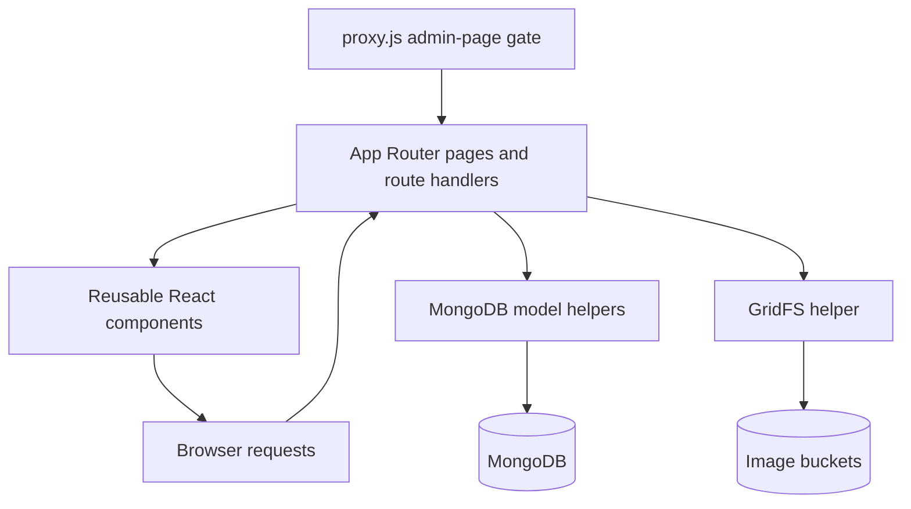

# Betopia PulseGrid - Technical Architecture

> Developer-facing application map. [Return to the overview](README.md).

## Architectural style

The private implementation is a single Next.js App Router application with three cooperating layers:

1. **Route/rendering layer:** public pages, dynamic content routes, staff screens, metadata, and HTTP handlers.
2. **Component layer:** reusable site shell, public sections, staff forms/tables, image picker, and chat UI.
3. **Data/domain layer:** MongoDB model helpers, GridFS abstraction, JWT/password utilities, and serialisation logic.



## Rendering modes

| Route type | Primary behavior |
|---|---|
| Static-style public pages | Compose reusable public components and fallback static assets. |
| Database-backed listings | Home, services, and leadership call model helpers on the server; service/leadership listing routes are `force-dynamic`. |
| Dynamic CMS pages | `[...slug]` performs parallel MongoDB reads, filters to published/active records, sorts sections, and renders via the section map. |
| Admin pages | Client-oriented management screens under a shared admin layout; page navigation is protected by `proxy.js`. |
| API routes | 23 route handlers partitioned by auth, content, contact, chat, media, and settings. |

## Core module boundaries

| Directory | Responsibility | Boundary rule |
|---|---|---|
| `src/app` | Routes, layouts, page-level rendering, metadata, HTTP response semantics | No reusable domain queries directly inside interactive UI. |
| `src/components` | Presentation, forms, client interaction, layout, visual section composition | Do not query MongoDB directly from components. |
| `src/lib/db/models` | Collection-level data operations and `ObjectId` serialisation | Return response-safe data structures. |
| `src/lib/db` | MongoDB singleton and GridFS implementation | Keep database driver details behind helpers. |
| `src/lib/auth` | JWT sign/verify and password hashing/verification | Remain server-only and configuration-driven. |
| `src/data` | Initial static data for controlled first-time service/leader preload | Not a second long-term source of truth after DB ownership begins. |
| `src/proxy.js` | Edge-safe page-access guard for `/admin/*` | Do not import Node-only database helpers. |

## Dependency strategy

| Need | Current package choice |
|---|---|
| Framework/runtime | Next.js `16.1.6`, React `19.2.3` |
| Styling | Tailwind 4/PostCSS plus global CSS |
| Data and files | MongoDB driver `7.1.0`, GridFS, Sharp |
| Authentication | jose JWTs and bcryptjs password hashes |
| Forms | React Hook Form, Formik, Yup, Zod |
| Interaction | Framer Motion, Lenis, Swiper, Embla, Lucide, toast notifications |
| Quality | Next Core Web Vitals ESLint configuration and Prettier ecosystem |

The project currently includes several form/validation libraries. A future consolidation on one form/validation standard would reduce cognitive load and bundle surface.

## Dynamic page composition

`SectionRenderer.jsx` is the central extension point for CMS pages. It maintains a whitelist of section types rather than evaluating arbitrary stored code or HTML.

```text
CMS section.type
  -> SECTION_MAP[type]
  -> React component
  -> type-specific data object
  -> safe render with services/leaders supplied by route
```

The current map contains `hero`, `about`, `services-grid`, `leadership-grid`, `why-pulsegrid`, `vision`, `contact-section`, `breadcrumb`, and `text-block`. Adding a new section needs two coordinated changes: an editor form/type option and a corresponding renderer mapping. This prevents staff from creating content that the public route cannot render.

## Performance posture

- Server-rendered reads avoid making first public page content depend solely on a browser fetch.
- Service and leadership mutations call Next route revalidation for their public consumers.
- Lightweight client polling keeps active public tabs fresh; it is a deliberate small-scale trade-off rather than a real-time transport.
- `SmoothScrollProvider` respects `prefers-reduced-motion` and cleans up its animation frame work on unmount.
- The project configures `mongodb` and `bcryptjs` as server-external packages to prevent browser bundling.
- Modern production validation should add bundle analysis, image-size budgets, Lighthouse/real-user metrics, and cache-policy tests.

## Technical constraints

- JavaScript is used throughout; TypeScript would add interface-level protection for page/section/API data contracts.
- Dynamic metadata is currently focused on page titles; richer description, canonical, Open Graph, and structured-data coverage is an upgrade opportunity.
- The app currently exposes live freshness through polling rather than push events.
- The major security requirement is independent authorization in sensitive server handlers; route/page protection alone is not sufficient.
