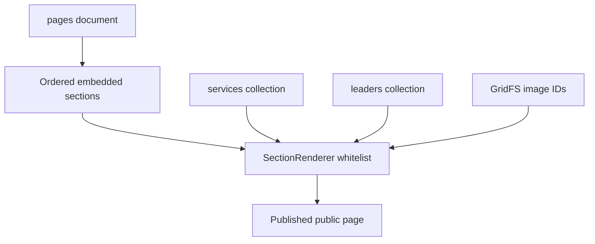
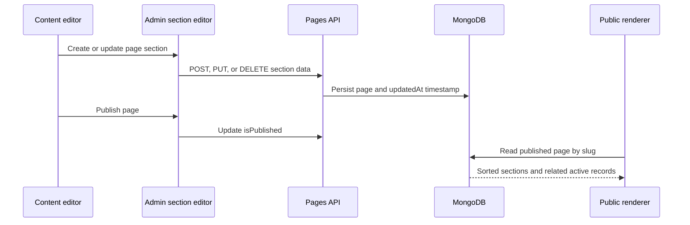
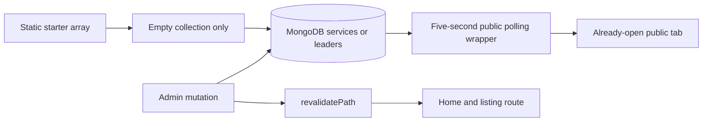

# Betopia PulseGrid - CMS and Content Engineering

> Developer-facing content-system reference. [Return to the overview](../README.md).

## CMS design

The CMS uses document-oriented page composition rather than storing page markup as one opaque HTML field. A `pages` document owns page identity, publish state, visual breadcrumb context, and an ordered `sections` array. Services and leadership remain separate collections so the same records can appear across the home page, listings, and CMS-driven sections.



## Page record contract

```ts
// Conceptual contract based on the private implementation.
type CmsSection = {
  id: string;                  // nanoid, stable in editor operations
  order: number;               // public render order
  type: string;                // must exist in SECTION_MAP
  data: Record<string, unknown>;
};

type CmsPage = {
  slug: string;
  title: string;
  breadcrumbImage: string;
  sections: CmsSection[];
  isPublished: boolean;
  createdAt: Date;
  updatedAt: Date;
};
```

### Operational invariants

| Invariant | Why it matters |
|---|---|
| Slug identifies the public catch-all route. | Makes page addressing deterministic and lets the CMS edit a content route without a new React page. |
| New pages start unpublished. | Prevents an incomplete page from appearing publicly. |
| Section `id` is a `nanoid`, not a database `_id`. | Supports focused section edits/delete/reordering within one parent document. |
| `order` is explicit and reindexed after reorder. | Rendering order is deterministic and editor behavior matches public output. |
| Section type is whitelisted. | Stored content cannot select an arbitrary component or executable behavior. |
| Page list projections omit the sections array. | The admin list avoids fetching editor-sized payloads unnecessarily. |

## Section renderer contract

`SectionRenderer` maps stored `section.type` to a known component. The private map currently supports:

| Section type | Public component responsibility | Data-owned details |
|---|---|---|
| `hero` | Homepage/video hero | Video, heading, supporting text, action label and target |
| `about` | Brief company/about content | Heading, image, badges |
| `services-grid` | Service card grid | Uses active service collection records; editor controls section context/link |
| `leadership-grid` | Leadership cards | Uses active leadership records and public profile/link context |
| `why-pulsegrid` | Differentiation/value proposition section | Title, reason list, background image, CTA visibility/link |
| `vision` | Vision content block | Items and image |
| `contact-section` | Contact conversion surface | Shared contact component configuration |
| `breadcrumb` | Page title and trail | Background image, title, route trail |
| `text-block` | Simple long-form content | Heading and paragraphs |

Unknown types render an explicit editor/developer-facing error state instead of silently executing stored data. A new type must be added to both the admin editor (`SECTION_LABELS` and field controls) and `SECTION_MAP` to be a complete feature.

## Content operations flow



### Section operations

- **Create:** determines the highest existing `order`, appends a section, and assigns a `nanoid` ID.
- **Update:** uses MongoDB's positional operator to replace the target section's `data` field.
- **Delete:** uses `$pull` against the embedded section ID.
- **Reorder:** rebuilds the ordered section list from the editor's desired ID order and persists newly indexed `order` values.
- **Page delete:** removes the page record and embedded sections; referenced GridFS files are intentionally not automatically deleted, which avoids accidental shared-file deletion but creates an orphan-cleanup responsibility.

## Services and leadership

`services` and `leaders` are separate first-class models with title/profile details, image identifiers or fallback paths, URLs, `order`, `isActive`, and timestamps. Public data access requests only active items and sorts by order; staff management can read and edit the complete set.

### Bootstrap, revalidation, and live refresh



The initial arrays are a bootstrap bridge, not an ongoing override. A collection preloads only when empty; once CMS records exist, the database becomes authoritative. Mutations revalidate `/` and `/services` or `/leadership`, while `LiveServicesSection` and `LiveLeadershipSection` make open public tabs feel live without a manual hard refresh.

## GridFS media pipeline

| Step | Implementation |
|---|---|
| Select | `ImageUploader` sends `multipart/form-data` to the upload handler. |
| Validate | Server accepts an image MIME allowlist and rejects files larger than 5 MB. |
| Store | `gridfs.js` opens an upload stream in the `images` GridFS bucket and returns the new image ID. |
| Reference | Page/section/service/leader stores the `imageId`; a helper turns it into `/api/images/:id`. |
| Deliver | The image handler resolves metadata and streams bytes from GridFS with the appropriate content type. |
| Remove | `bucket.delete()` removes matching files/chunks; automatic orphan cleanup is a planned improvement. |

## Editorial safeguards and next upgrades

| Current strength | Recommended next step |
|---|---|
| Draft/published pages | Add scheduled publishing, approval state, preview links, and version history. |
| Whitelisted section map | Add schema validation per section type and editor-side/route-side validation parity. |
| Deterministic order | Add optimistic-concurrency/version controls to avoid simultaneous editor overwrite. |
| GridFS media abstraction | Track ownership/references and perform safe orphan detection/cleanup. |
| Revalidation/live polling | Establish cache/polling budgets and migrate high-value conversations to push events where justified. |

## Public boundary

This document describes the actual technical contract and extension seams. It does not expose page content, GridFS media, editor accounts, source files, or deployment configuration.
