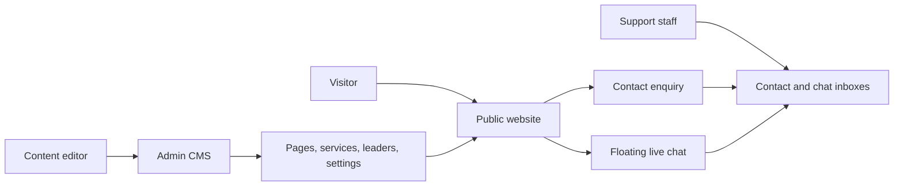
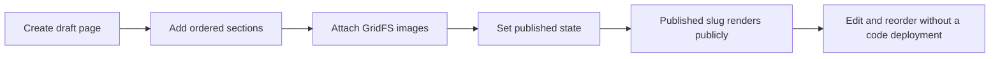
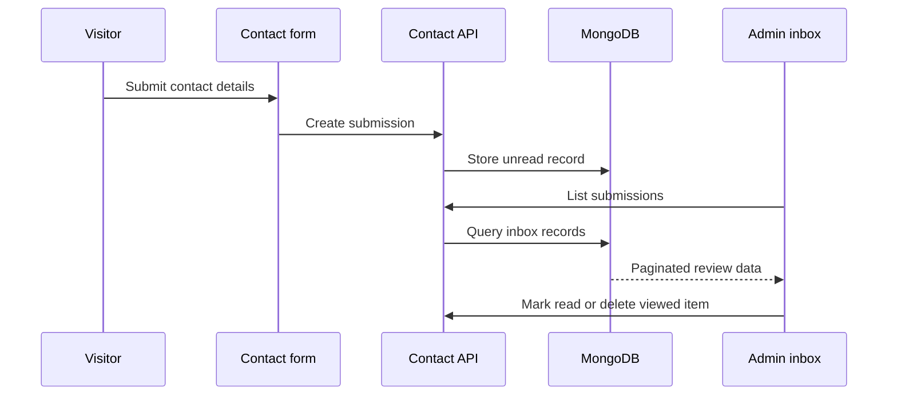

# Betopia PulseGrid - Product Capabilities and User Workflows

> Public technical-review document. [Return to the overview](../README.md).

## Product position

Betopia PulseGrid is designed to replace a static corporate web presence with a staff-operated digital platform. The current private implementation focuses on the core public site, content operations, visitor communication, and support workflow - not the entire long-term enterprise platform described in the SRS.

## Experience map

## Public website journey

| Stage | User value | Current implementation |
|---|---|---|
| Discover | Learn the company's position and capabilities. | Home, about, services, leadership, contact, and company-information routes. |
| Explore | Find a service or a staff/profile area. | Active service/leader records rendered from MongoDB-backed models. |
| Read a campaign/custom page | Content can be tailored without a new front-end route. | Published slug is served by the catch-all CMS-page renderer. |
| Ask a question | Send a structured contact message. | Public form writes an unread contact submission. |
| Start a conversation | Receive an immediate support-channel experience. | Persistent browser session plus server-stored chat history and staff replies. |

## Dynamic CMS page journey

1. An editor creates a page with a title and unique slug; it begins as a draft.
2. The section editor adds one of the supported section types and saves its type-specific `data` object.
3. Sections get stable `nanoid` IDs and their ordering determines public rendering order.
4. The editor can update, delete, or reorder sections and can set page publication state.
5. The public catch-all route renders only the published page and sorts the section list before mapping it through `SectionRenderer`.

## Contact inbox workflow

The public submission route requires a first name and email. Staff can list submissions, change read state, and delete a message after it has been viewed. This intentionally creates a minimal intake-to-inbox workflow without claiming CRM features that are still future scope.

## Live-chat workflow

| Step | Visitor side | Staff side |
|---|---|---|
| Session | Widget creates or resumes a browser-stored `pulsegrid_chat_session_key`. | Admin inbox lists sessions and open/closed state. |
| Message | Visitor posts a message; session history persists in MongoDB. | Staff reads the conversation and replies from the selected session. |
| Read state | Widget polls while open for new replies. | Opening the thread can mark visitor content as read. |
| Closure | Visitor can end a session and start a new one. | Staff can terminate a session; closed sessions become read-only. |

The current chat channel uses polling, which favors implementation simplicity and works without a persistent WebSocket service. A real-time transport can be introduced later when scale, delivery guarantees, presence, and cost justify it.

## Content and public freshness

Services and leadership are database-backed but can preload from static arrays the first time their collection is empty. Once records exist, the CMS data is authoritative. Staff mutations revalidate `/` and the corresponding listing route, while already-open public sections use lightweight polling at roughly five-second intervals.

This is a practical transition pattern: static data makes initial content available, while operations can take ownership through the CMS without a content migration blocking launch.

## Delivered versus future scope

| Delivered now | Not yet represented end to end |
|---|---|
| Corporate site, CMS pages/sections, service/leader management, settings, GridFS images, contact inbox, admin login, chat | Full client portal, project/document management, dedicated blog CMS, careers/jobs workflow, analytics, CRM, payment, localization, PWA, mobile apps, IoT monitoring |

The SRS contains these future concepts as product direction. This public review treats them as roadmap opportunities rather than shipped capability.

## Product expansion opportunities

- Add a project/case-study data model and protected client document sharing.
- Extend contact submissions into a role-aware CRM workflow with assignment and response history.
- Replace chat polling with an event-driven channel when operational demand warrants it.
- Introduce content versioning, scheduled publishing, approval states, and rollback.
- Add multilingual content, richer search, consent-aware analytics, and sector-specific energy monitoring integrations.
