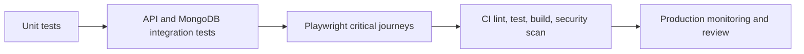

# Betopia PulseGrid - Security, Quality, and Roadmap Review

> Evidence-based technical review. [Return to the overview](../README.md).

## Review stance

This document distinguishes current security foundations from the work required for a production-hardening claim. It is neither a penetration test nor a compliance certification; no private data, credentials, or exploit instructions are included.

## Current security foundations

| Area | Current implementation | Value |
|---|---|---|
| Credentials | `bcryptjs` hashes and verifies staff passwords. | Passwords are not stored as plaintext. |
| Session | `jose` signs and verifies HMAC JWTs; session is delivered through an httpOnly admin cookie. | Browser JavaScript cannot directly read the session cookie. |
| Login response | Generic credential errors and a dummy comparison path. | Reduces simple username-enumeration timing/response differences. |
| Page gate | `proxy.js` verifies the session cookie for `/admin/*` page navigation and redirects absent/invalid sessions. | Blocks casual direct navigation to staff screens. |
| Seed guard | Initial-admin bootstrap is designed to be blocked in production. | Prevents a development bootstrapping workflow from becoming a production account-creation route. |
| Upload validation | Image MIME allowlist and 5 MB server-side limit. | Rejects many invalid/unexpected uploads before GridFS storage. |
| Draft visibility | Dynamic public route queries `isPublished: true`. | Draft CMS pages are not publicly rendered by the standard catch-all route. |

## Priority hardening findings

### P0 - Server-side authorization on sensitive handlers

The private review found page-route protection in `proxy.js`, but sensitive server handlers need their own independent authorization decision. Page redirects are a user-experience control; they are not a sufficient substitute for verifying the admin session inside every privileged API route.

**Required remediation:** introduce a central server-safe `requireAdmin()` helper that reads/verifies the cookie, call it before every staff mutation/read of sensitive data, and add negative authorization tests for all sensitive route families. Do not consider admin controls production-hardened until that boundary is enforced and tested.

### P1 - Consistent validation and abuse controls

Current handlers include useful required-field and upload checks, but schema validation is uneven. Add shared Zod schemas for page/section shapes, IDs, service/leader/settings changes, contact input, and chat messages. Add login, contact, chat, upload, and staff-mutation rate limits; cap string lengths; sanitize/validate URLs; and introduce a cookie-authenticated CSRF strategy.

### P1 - Security headers and observability

Define an explicit CSP, frame policy, referrer policy, MIME-sniffing protection, and transport/header baseline. Add error monitoring, structured audit logging, alerting, and dependency/secret scanning so a deployed system produces evidence instead of relying on manual observation.

### P2 - Roles, audit history, and media lifecycle

The current staff model is intentionally simple. Before multiple operational roles exist, introduce RBAC claims and server checks for editor, support, administrator, and super-administrator responsibilities. Record actor/action/time/target audit events. Track GridFS ownership and references so an orphan cleanup process can safely remove unreferenced uploads.

## Quality status

| Topic | Current evidence | Next quality gate |
|---|---|---|
| Lint | ESLint 9 + Next Core Web Vitals configuration exists. | Run in CI on each change. |
| Build | Standard Next build script exists. | Run reproducible production build in CI. |
| Manual flows | Private `TESTING.md` covers public, CMS, chat, contact, upload, and auth flows. | Convert critical flows into repeatable automated tests. |
| Domain tests | No dedicated automated unit/integration suite is represented. | Vitest/Jest for helpers/models; integration tests against isolated MongoDB. |
| End-to-end | No E2E runner represented. | Playwright flows for login, page publish, image upload, contact, chat, and authorization. |
| Accessibility/performance | Core Web Vitals lint preset and responsive UI tooling. | Lighthouse budgets, keyboard/screen-reader checks, real-user metrics, mobile/network testing. |

## Recommended test matrix

| Priority flow | Assertions |
|---|---|
| Admin session | Invalid/missing/expired session cannot load protected page or invoke privileged handler. |
| CMS publishing | Draft is hidden; published page renders correct sorted sections; unsupported type fails predictably. |
| Services/leaders | Active visibility, order, revalidation, and public polling behavior. |
| Upload | Invalid MIME/oversize rejection; valid image stream; reference/delete lifecycle. |
| Contact | Required fields, unread/read state, deletion restriction, rate limit. |
| Chat | Session persistence, message ordering, staff reply visibility, closure immutability, ownership/authorization. |
| Metadata | Published dynamic page title, not-found behavior, future canonical/OG policy. |

## SRS reconciliation

The SRS is a broad future-oriented requirements document. The implementation currently delivers the foundation shown below.

| Current implementation | SRS / roadmap direction |
|---|---|
| Public corporate site and CMS-driven custom pages | Advanced service catalogue, projects/case studies, blog/news management, careers/jobs. |
| One admin identity model and protected page area | RBAC, content manager/client roles, audit trail, 2FA, account lifecycle. |
| Contact inbox and live chat | CRM, lead routing/scoring, response templates, email campaigns, analytics. |
| GridFS image media | Client document portal, versioning, access sharing, external storage/CDN. |
| Polling/revalidation freshness | Event-driven real-time updates, offline/PWA capability, native mobile app. |
| Basic metadata | Structured data, SEO dashboard, localization, comprehensive performance monitoring. |
| Corporate foundation | IoT device/grid monitoring, predictive analytics, partner/vendor workflows. |

## Phased upgrade plan

| Phase | Focus | Exit criteria |
|---|---|---|
| 1. Protect | Handler-level authorization, Zod schemas, rate limits, CSRF/header baseline, secret/dependency scanning. | Sensitive handler negative tests pass; security review evidence exists. |
| 2. Prove | Unit, API integration, E2E, CI, error monitoring, backup/restore rehearsal. | Pull requests run quality gates; critical user paths are regression tested. |
| 3. Operate | RBAC, audit log, content versioning, media cleanup, performance budgets. | Multiple staff roles work with traceability and operational dashboards. |
| 4. Expand | CRM/notification adapters, project/client portal, content domains, localization, analytics. | New domains have data ownership, consent, retention, and integration contracts. |
| 5. Innovate | PWA/mobile/IoT/AI features after product evidence. | Offline, device, and AI behavior meet privacy, safety, and support standards. |

## Public boundary

Security findings are documented at the control/design level to support responsible engineering review. No credentials, request payloads, private URLs beyond architecture naming, deployment data, or exploit steps are published.
